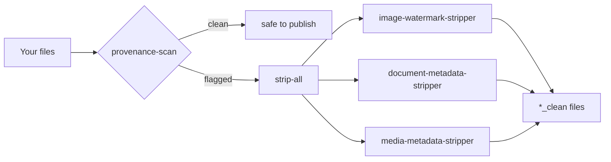

<div align="center">


# HyPass

**Strip AI provenance metadata from your files.**

[](https://github.com/JrKrishh/HyPass/actions/workflows/test.yml)
[](LICENSE)


</div>

HyPass is a suite of Claude Code skills for clean, human-owned output. It removes machine-readable provenance — C2PA content credentials, EXIF/XMP, Office and PDF metadata, audio/video tags — and keeps your git history human. It also tells you, honestly, what it **can't** remove.

## Install

### One step, in Claude Code

```
/plugin marketplace add JrKrishh/HyPass
/plugin install hypass@hypass
```

The first line registers this repo as a marketplace (once per machine); the second installs the `hypass` plugin with **all seven skills**. Dependencies for the stripper scripts: `pip install Pillow pikepdf`, plus `ffmpeg` on PATH for audio/video.

<details>
<summary><b>Manual install (no plugin)</b></summary>

Clone and run the installer, which copies each skill into `~/.claude/skills/`:

```bash
# macOS/Linux
git clone https://github.com/JrKrishh/HyPass.git /tmp/HyPass
bash /tmp/HyPass/install.sh
```

```powershell
# Windows (PowerShell)
git clone https://github.com/JrKrishh/HyPass.git "$env:TEMP\HyPass"
powershell -ExecutionPolicy Bypass -File "$env:TEMP\HyPass\install.ps1"
```

Restart Claude Code to load them. Python deps: `pip install -r requirements.txt`.
</details>

## Skills

|  | Skill | What it does |
|:--:|---|---|
| 🖼️ | **image-watermark-stripper** | Strips C2PA, EXIF, XMP, IPTC, and PNG text chunks from images. `--check` scans only. |
| 📄 | **document-metadata-stripper** | Clears author/company/app metadata from Office docs and PDFs. `--deep` also removes tracked changes, comments, hidden text, and OLE objects. |
| 🎞️ | **media-metadata-stripper** | Drops tags from audio/video with ffmpeg — no re-encode, no quality loss. |
| 🧹 | **strip-all** | Auto-detects file type and routes each file to the right stripper. Clean a whole folder in one command. |
| 🔎 | **provenance-scan** | Read-only auditor: reports which files carry provenance. `--json` + a pre-commit hook for CI gates. |
| ✍️ | **git-human-commits** | Keeps commits and PRs human-authored — no AI trailers or "Generated with" footers. |
| 🫥 | **text-watermark** | Explains the SynthID-style text watermark **no tool can strip**, with a human-rewrite checklist. |

See [INDEX.md](INDEX.md) for per-skill detail.

## How it works



## Scan vs strip

Two different operations, easy to confuse:

- **Strip** *removes* metadata — and clears the fields regardless of contents (author, company, timestamps, custom properties), leaving the document body untouched.
- **Scan** (`provenance-scan`, and the `--check` flag) only *reports* — it looks specifically for AI provenance markers (C2PA, JUMBF, Claude, Anthropic) and writes nothing.

A scan reporting "no markers" means no Claude/C2PA provenance was found — **not** that the file has no metadata. A strip still clears that metadata. Use scan to audit before publishing; use strip to actually clean.

## The honest limit

HyPass removes **metadata**. The **SynthID-style watermark woven into Claude's text** is not metadata — it's a statistical bias in word choice, so no stripper can remove it. Only a genuine human rewrite degrades it. See the [`text-watermark`](skills/text-watermark/SKILL.md) skill for how it's embedded and what actually weakens it.

## Remove Claude git/PR attribution (one-time)

Add to `~/.claude/settings.json`:

```json
{
  "attribution": { "commit": "", "pr": "", "sessionUrl": false }
}
```

This removes the `Co-Authored-By: Claude` commit trailer, the "Generated with Claude Code" PR footer, and the Claude-Session link.

## Notes

- C2PA metadata stripping is permanent — the credential cannot be recovered once stripped.
- Attribution removal is cosmetic: Claude text still carries the invisible SynthID text watermark, which only a human rewrite degrades.
- Skills are personal-use tools for your own generated content.

## Contributing

See [CONTRIBUTING.md](CONTRIBUTING.md) for running the test suite, commit style, and optional verified-commit signing.
